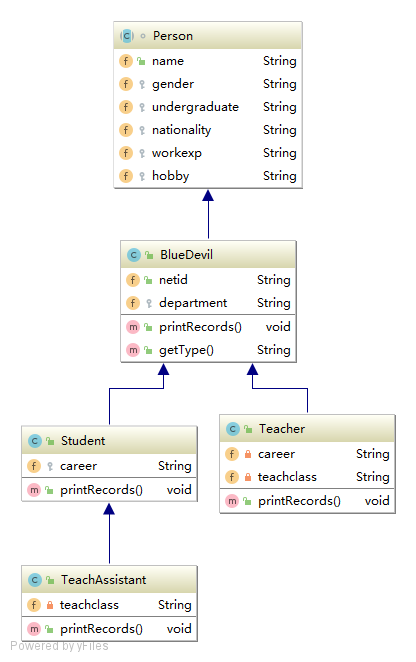

# ECE651_HW2

This project is for ECE-651 Homework2 "First Java Program"

## Project Summary 

### Summary
I have completed these functions in this project:
1. Create a base data model for storing information about Duke Member.
2. Populate the data model with information about yourself, the TAs and the Professor.
3. Provide a search function ("whoIs") to search an array of those objects by first name and last name.
4. Provide an add function to add Duke Member into the "DataBase".
5. Provide a function to list all the members in specific department
6. Provide a user interaction cmd platform and input error checking.

### OO Design
<div align=center></div>

### Main Methods


## Getting Started

These instructions will get you a basic idea of how to use this data model

### JAVA Environment

This project was written and tested in the below JDK version:

```
JDK 1.8.0_191
```

### Running

To start, just input 1, 2 or 3 and press Enter! You could follow the instructions on the screen. I provide a detecting logic to prevent some improper inputs.


#### Search a Duke Member

- Type the full name (First Name Last Name) and press enter 
- If there exists same name, please input the netid (**I will provide all the possible netids with such name**)

> Demo Output:

#### Add a Duke Member

- Follow the instruction on the screen and type the related information.
- Some properties have fixed choices.
- Some choice may ask for extra information (i.e. TA teaches which class)

#### List all the members in secific Department
- Follow the instruction on the screeen and input the correct department name.

> Demo Output:

## Design Idea

Explain the Design Details of my project

### OO Design

<div align=center></div>

- **Level**: For each member, firstly he is a person with some basic properties(name, gender, etc..), then to be a bluedevil, he should have a netid. I use this common and uncommon properties to design class.
- **Abstract and Override**: Since we need to implement "whois" and different type duke member may have different properties to print out, we should use function override. In parent class (BlueDevil), we give a basic description of the person. Then in child class (Student/Teacher), we override the "whois" function by following form:
```
@Override
super(commonparameter)
print(newparameter)
```
- **Upcasting & Downcasting**: I use hashmap to store member information (discussed after). To handle the different child class, I use the upcasting strategy to store it. Then when I need print the information of the bluedevil, I downcast the object according to the class type.

### Searching & Adding Records
- **HashMap**: I use HashMap<String, Vector> to store all the BlueDevils by name. When meeting the same name string, I push the BlueDevil into Vector. 
- **Searching Logic**: When searching the name that exists several BlueDevils records, use unique netid to distinguish them
- **Netid**: When adding bluedevil whose name has already been stored into the Map, Generate the unique netid automatically with the format of (first char of firstname + first char of first name + "Appeartimes+1")

## Built With

* [IntelliJ](https://www.jetbrains.com/idea/) 


## Authors

* **Wending Lin** (NetID: wl177)

